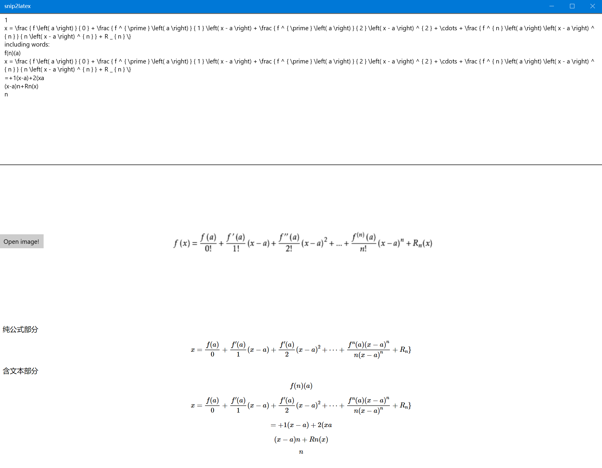

# Snip to Latex
An UWP app converting image to LaTeX formula expression based on third party api.

The project use Baidu Ai formulas recognizing Api (I was hoping to use Mathpix 's api but it requires an visa credit card). It's obvious that the outcome would not match what was expected . But it still could be use in some simple task such as recognizing simple math examination paper.

The viewing render is using mathjax online javascript and based on a local html page. 

Current version is only a demo since there were many bugs reveal during coding. More function and features would be added. Complete User Interface would be completed soon.

Project Structure:

- Model/
  - DataWrapper.cs : JsonDeSerializer and model for the  json returned from api
- BaiduApi.cs : use HttpClient to send POST request to baidu to get token
- LatexFacade.cs : A facade design pattern to due with the relation between image file and Model class
- MainPage.xaml/MainPage.cs : UI and event handlers
- MyToken.cs : const pool, please don't use the Key in the file
- WebServer.cs : to build a MathJax redering page 

Current preview: (row is the latex code after recognized and converted, row2 is the input image, row3 is the rendered latex preview page )

